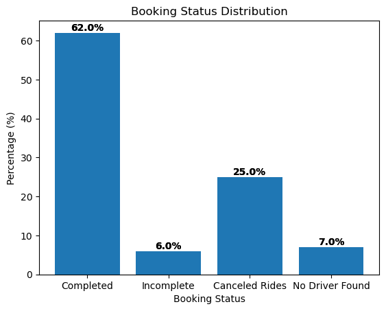
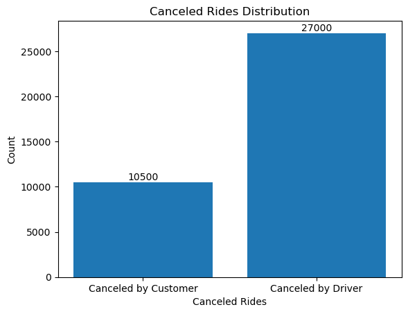
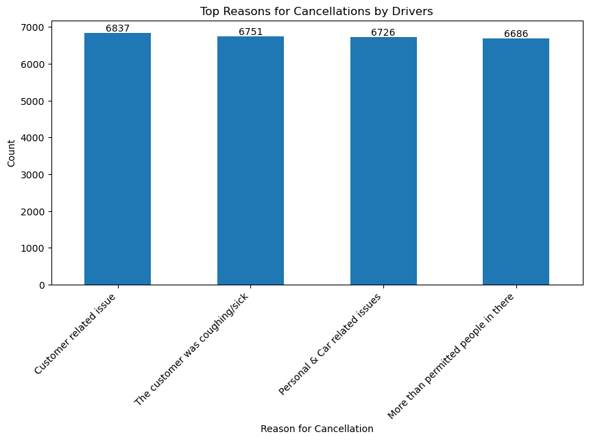
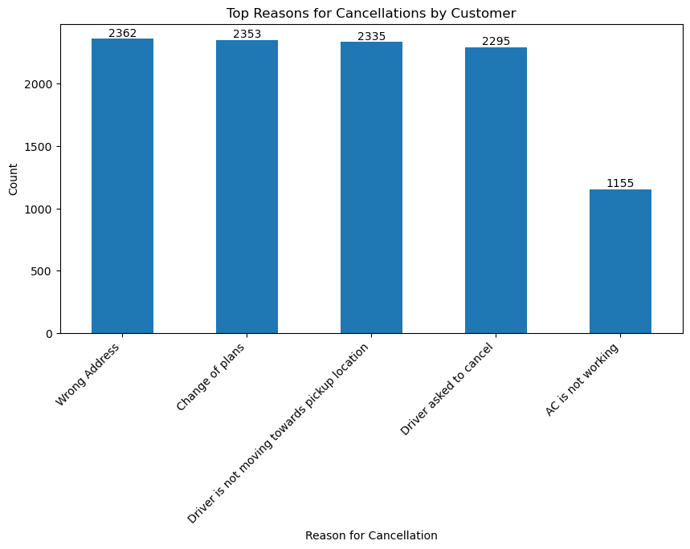
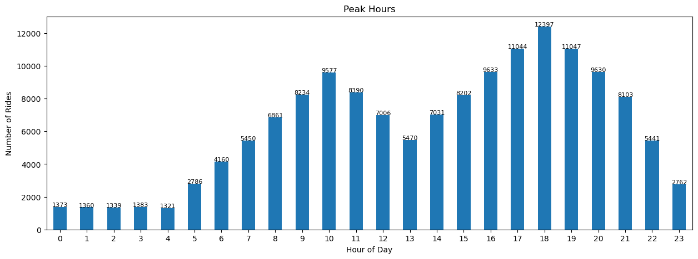
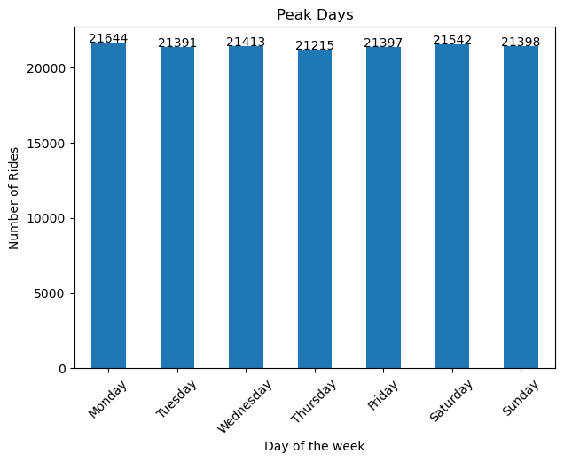
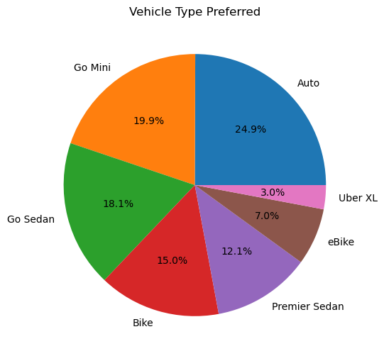
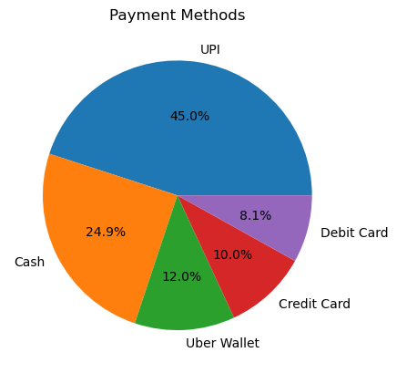
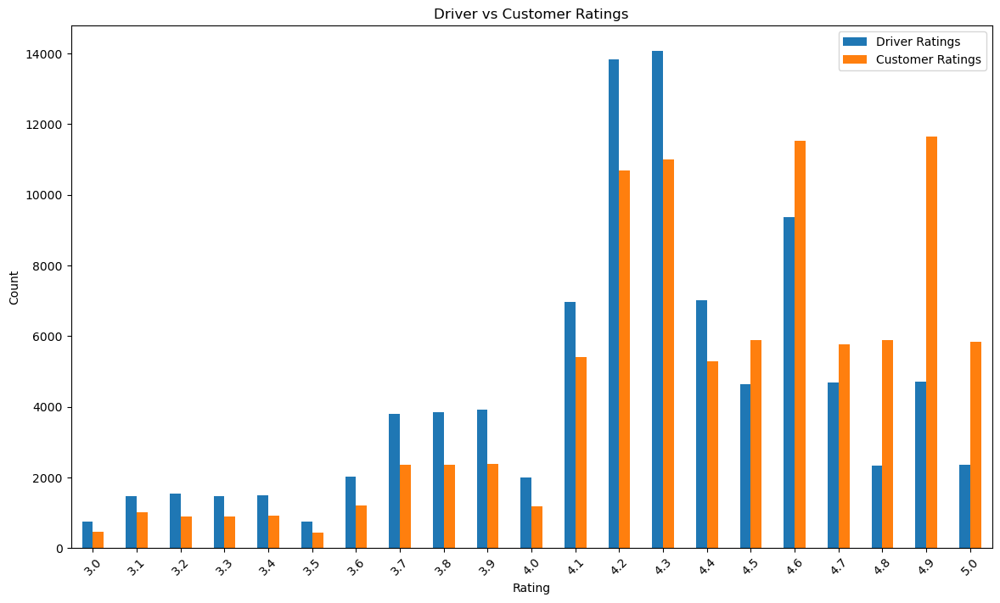

** Uber Rides Analysis (2024)
 
**TL;DR:** Analyzed 2024 Uber booking data and found that ride price shows almost no correlation with distance (r = 0.01) — fares appear driven primarily by zone, time, and surge pricing rather than trip length. Also identified a 25% cancellation rate, with drivers cancelling 2.5x more often than customers.
 
## Business Problem
Uber ride bookings involve significant inefficiencies — high cancellation rates, unclear pricing logic, and demand spikes during specific hours. This project analyzes 2024 booking data to surface patterns in completion rates, cancellations, demand, and pricing that could inform operational decisions.
 
## Dataset
- **Source:** [Kaggle + https://www.kaggle.com/code/mueezraja/ola-ride-booking-data-eda/input]
- **Scope:** All rides booked in 2024, including completed, cancelled, and incomplete rides
- **Size:** 150,000 rows

## Tools Used
- Python (pandas, numpy)
- Matplotlib for visualization
- Jupyter Notebook
- Tableau for dashboarding (development only; not included in repo)

## Data Cleaning
- Verified `Booking Status` categories were consistent (no whitespace/casing duplicates) — confirmed via `value_counts()`, totals reconciled exactly to 150,000 rows
- Checked `Booking Value` and `Ride Distance` for outliers or invalid entries (negative/zero values) — none found; min/max ranges are plausible
- Cleaned stray quotation marks embedded in `Customer ID` values (a CSV export artifact)
- Standardized inconsistent category labels in `Vehicle Type` and `Payment Method`
- Missing values in cancellation- and incomplete-reason columns are **structural, not missing data** (e.g., a completed ride has no cancellation reason by definition) — these were retained rather than dropped or imputed

## Summary Statistics
 
| Statistic | Booking Value (₹) | Ride Distance (km) |
|---|---|---|
| Count | 102,000 | 102,000 |
| Mean | 508.30 | 24.64 |
| Std Dev | 395.81 | 14.00 |
| Min | 50.00 | 1.00 |
| 25% | 234.00 | 12.46 |
| 50% (Median) | 414.00 | 23.72 |
| 75% | 689.00 | 36.82 |
| Max | 4277.00 | 50.00 |
 
*Note: Booking Value and Ride Distance are only populated for rides that progressed far enough to have fare/distance data (102,000 of 150,000 total rides) — cancelled and no-driver-found rides have no value here by design.*
 
## Key Insights
 
**1. Ride Completion**
Only 62% of booked rides were completed. 7% failed due to "No Driver Found," 25% were cancelled (driver-side cancellations 2.5x higher than customer-side), and 6% remained incomplete.


**2. Cancellation Behavior**
Drivers cancelled far more rides than customers (27,000 vs 10,500). Customer cancellation reasons were spread evenly (wrong address, driver unresponsive, change of plans), while driver reasons were vague and dominated by a single catch-all category ("Customer related issue").




**3. Demand Patterns**
Bookings peaked during evening hours (17:00–19:00), with the 18:00 hour alone recording 12,397 rides. Demand was consistent across all 7 days — no meaningful weekday vs. weekend variation.



**4. Vehicle Preference**
Budget options dominate: Auto (24.9%), Go Mini (19.9%), and Go Sedan (18.1%) together account for ~63% of bookings. Premium vehicles make up only ~3%.


**5. Payment Modes**
UPI leads at 45%, followed by cash at 24.9% — together nearly 70% of all transactions.


**6. Ratings Distribution**
Customers rate drivers higher on average (4.4) than drivers rate customers (4.23), suggesting drivers may experience more friction during rides than is reflected in customer feedback.


**7. Price Structure**
Booking value shows almost no correlation with ride distance (r = 0.01), consistent even after controlling for vehicle type and excluding incomplete rides. This suggests fares are driven more by zone, time, and surge pricing than by distance travelled.
 
## Recommendations
1. Improve driver availability during 17:00–19:00 through peak-hour incentives to close the demand-supply gap.
2. Reduce cash dependency by promoting UPI cashback offers or requiring drivers to maintain adequate change, reducing payment friction.
3. Audit the fare calculation model — the weak distance-price correlation suggests either pricing inconsistency or an opportunity for more transparent, distance-aware pricing.
4. Maintain strong Auto/Go Mini/Go Sedan fleet supply given consistently high demand for budget vehicle types.

## Limitations
- Dataset covers a single year (2024) — trends may not generalize to other periods
- "Customer related issue" from driver side as a dominant cancellation reason lacks granularity; root cause unclear
- Correlation analysis is limited to price vs. distance; other variables (e.g., time of day, surge multiplier) were not fully modeled
- No statistical significance testing was performed on differences (e.g., cancellation rate by vehicle type)

## How to Run
1. Clone this repo
```bash
   git clone https://github.com/vinodbadesha/uber-rides-analysis.git
```
2. Install dependencies
```bash
   pip install -r requirements.txt
```
3. Open the notebook in Jupyter and run all cells
## Project Structure
```
├── data/
├── rides-data.ipynb
├── README.md
└── requirements.txt
```
 
## Author
Vinod Badesha - https://www.linkedin.com/in/vinodbadesha/